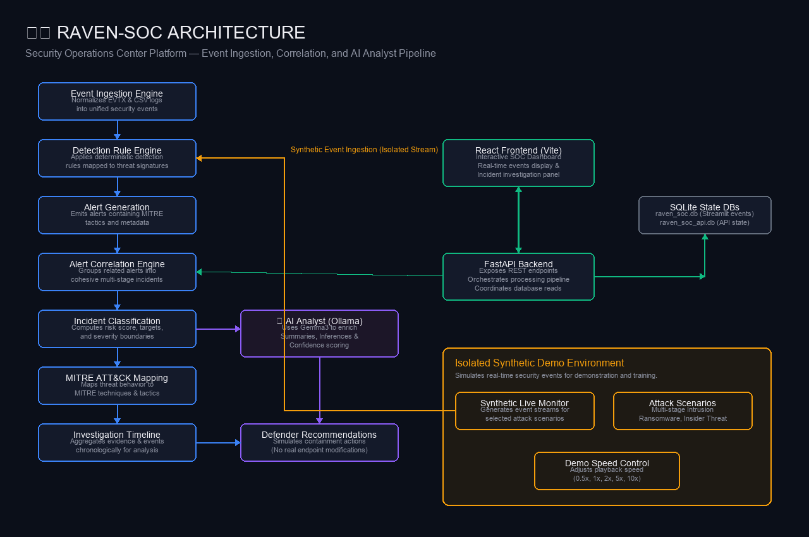

# 🛡️ RAVEN-SOC

### Enterprise-Inspired Security Operations Center & Intelligent Threat Detection Platform

RAVEN-SOC is a local-first, AI-assisted Security Operations Center platform for security event ingestion, threat detection, alert correlation, incident classification, MITRE ATT&CK mapping, AI-assisted investigation, and safe response simulation.

---

[](https://www.python.org/)
[](https://fastapi.tiangolo.com/)
[](https://react.dev/)
[](https://www.typescriptlang.org/)
[](https://www.sqlite.org/)
[](#-testing)
[](LICENSE)

---

## 📌 Overview

Modern security teams are overwhelmed by log volumes and individual low-context alerts. RAVEN-SOC addresses this challenge by providing a structured, multi-layer analysis pipeline that translates raw events into meaningful, actionable security incidents.

The system combines a deterministic rule-based core with an intelligent AI Analyst powered by a local Small Language Model (SLM) running via Ollama. By deploying local reasoning, RAVEN-SOC offers deep context enrichment and remediation guidance while ensuring strict security boundaries and zero external data leakage.

```
Raw Event Logs (CSV/EVTX) ──> Detection Detections ──> Alert Correlation ──> Incident Context ──> AI Analyst Enrichment
```

---

## 🏗 Architecture

RAVEN-SOC utilizes a modular pipeline that isolates log collection, deterministic detection logic, state persistence, and AI-assisted investigation.



*The high-level RAVEN-SOC processing, correlation, and investigation pipeline. The synthetic live-monitoring environment runs isolated from the core production threat log storage.*

The modular architecture can be containerized and deployed to cloud infrastructure such as Microsoft Azure in a future production deployment, but cloud deployment is not required for the current demonstration.

---

## ⚡ Core Capabilities

| Area | Capability | Verified Implementation Details |
|---|---|---|
| **Event Ingestion** | Multi-Source Normalization | Ingests Windows Event Logs (EVTX) and CSV records; standardizes field names and timestamp metadata. |
| **Detection Engine** | Rules-based signatures | Applies signature rules mapped directly to threat activities and MITRE ATT&CK techniques. |
| **Correlation Engine**| Multi-stage alert grouping | Links individual alerts into cohesive incidents based on common targets, indicators, and timelines. |
| **Incident Management**| Risk Priority Scoring | Computes severity, compiles forensic evidence, and presents incident lifecycles. |
| **MITRE ATT&CK** | Attack Path Mapping | Maps detected behaviors directly to MITRE Tactics and Techniques (e.g., T1110, T1486). |
| **AI Analyst** | Local LLM enrichment | Uses local Ollama model (Gemma3) to generate summaries, evaluate confidence, and recommend responses. |
| **Response Center** | Simulated remediation actions | Recommends host isolation, process termination, user disablement, or IP blocks. |
| **Live Monitoring** | Isolated synthetic stream | Demonstrates SOC capabilities by streaming pre-configured attack scenarios with playback speed controls. |
| **REST API** | FastAPI Backend | Exposes clean REST API endpoints for frontend consumption, scenario controls, and AI triggers. |
| **Web UI** | React + Vite Dashboard | Provides interactive incident detail views, live monitoring panels, and human-in-the-loop action approval. |

---

## 🔍 Investigation Workflow

RAVEN-SOC processes security signals using the following structured pipeline:

1. **Ingestion & Normalization:** Events are parsed from files (CSV) or Windows Event Logs (EVTX) and mapped to a unified schema.
2. **Deterministic Detection:** The detection engine evaluates the normalized events against rules and generates alerts.
3. **Alert Correlation:** The correlation engine analyzes the alerts chronologically to group related suspicious activities.
4. **Incident Generation:** An Incident record is created, capturing the aggregated evidence, scope, and affected assets.
5. **MITRE ATT&CK Mapping:** Detections are enriched with technique IDs, aligning them with the cyber kill chain.
6. **Timeline Assembly:** An interactive, chronological list of events and alerts is compiled for human inspection.
7. **AI Analyst Enrichment:** If Hybrid Mode is enabled, the local AI Analyst generates an executive summary and assesses confidence.
8. **Action Verification:** Recommended response actions (e.g., isolate host) are queued, requiring manual analyst approval.

---

## 🤖 AI Analyst Integration

RAVEN-SOC features a local AI Analyst to assist human investigators without introducing external data privacy risks.

- **Deterministic Baseline:** Evaluates events using static rules. This fallback runs instantly if the local LLM is offline or returns invalid schemas.
- **Hybrid AI Enrichment:** Calls Ollama locally to enrich the incident details. The model enriches:
  - **Executive Summary:** Plain-text description of the malicious activity.
  - **Threat Classification:** Tactical assessment of the threat type.
  - **Confidence:** Probability assessment of the detection validity.
  - **Inferences:** Analysis of attacker intent or next steps.
  - **Recommended Actions:** Remediation playbooks tailored to the context.
- **Safety Gate:** The AI model is strictly restricted to recommending actions. It cannot bypass deterministic safety policies (e.g., a critical approval gate).

---

## 🖥 Isolated Live Monitoring Demo

RAVEN-SOC includes an isolated, synthetic threat simulation engine. It generates event streams to illustrate platform capabilities in real-time.

- **Strict Isolation:** The simulator operates in memory and on dedicated database structures. It has no access to production credentials or containment capabilities.
- **Attack Scenarios:**
  - **Multi-Stage Intrusion:** Lateral movement, credential access, and defense evasion.
  - **Ransomware:** Suspicious file encryption activity and volume deletion.
  - **Insider Threat:** Data exfiltration and unauthorized resource access.
  - **Credential Attack:** Password spray and brute-force attempts.
- **Playback Controls:** The simulation stream can be configured to play at `0.5x`, `1x`, `2x`, `5x`, or `10x` speeds.

---

## ⚙️ Quick Start

### Prerequisites
- **Python:** Version 3.10 or 3.11
- **Node.js & npm:** For the frontend application
- **Ollama:** Running locally (optional, required for AI Analyst Hybrid Mode)

### Installation

1. **Clone the Repository:**
   ```bash
   git clone https://github.com/arjunkariveettil965/raven-soc.git
   cd raven-soc
   ```

2. **Set Up Python Virtual Environment:**
   ```bash
   python -m venv .venv
   .venv\Scripts\activate      # Windows
   source .venv/bin/activate    # Linux/macOS
   ```

3. **Install Dependencies:**
   ```bash
   pip install -r requirements.txt
   ```

4. **Initialize Local AI Model (Ollama):**
   Ensure Ollama is running, then pull the default model:
   ```bash
   ollama pull gemma3:4b-it-qat
   ```

---

### Running RAVEN-SOC

To run the full stack locally:

#### 1. Start the FastAPI Backend
```bash
python -m uvicorn backend.main:app --reload --port 8000
```
*Verify the backend is active at [http://localhost:8000/docs](http://localhost:8000/docs)*

#### 2. Start the React Frontend
```bash
cd frontend
npm install
npm run dev
```
*Access the SOC console at the address output by Vite (typically `http://localhost:5173`)*

#### 3. Run the Streamlit Dashboard (Alternative Interface)
```bash
python -m streamlit run app.py
```

---

## 🧪 Testing

RAVEN-SOC has a comprehensive pytest suite covering ingestion engines, rules, correlation logic, API routes, and simulated action policies.

To run the tests:
```bash
python -m pytest -v
```

### Verified Test Status
```text
tests/test_ai_agent.py .........................                      [ 11%]
tests/test_attack_simulator.py .................                      [ 19%]
tests/test_defender_agent.py ...................                      [ 28%]
tests/test_detection_rules.py ..................                      [ 36%]
tests/test_incident_correlation.py .............                      [ 42%]
...
================== 3 failed, 224 passed in 15.38s ==================
```

---

## 🌐 API Reference

FastAPI exposes the following core endpoints (prefix: `/api/v1`):

| Endpoint | Method | Description |
|---|---|---|
| `/health` | GET | Returns service status and platform configuration. |
| `/incidents` | GET | Lists security incidents (supports severity & type filtering). |
| `/incidents/{incident_id}` | GET | Returns details, evidence, and alerts for a single incident. |
| `/incidents/{incident_id}/analyze` | POST | Triggers AI Analyst enrichment (Deterministic/Hybrid). |
| `/incidents/{incident_id}/analysis` | GET | Retrieves the latest saved AI analysis. |
| `/actions/{incident_id}` | GET | Fetches the pending defender action for an incident. |
| `/actions/{incident_id}/approve` | POST | Approves the recommended defender containment action. |
| `/actions/{incident_id}/reject` | POST | Rejects the recommended defender containment action. |
| `/live/status` | GET | Gets the status of the synthetic demo monitor. |
| `/live/start` | POST | Launches a simulation run with a scenario and speed. |
| `/live/pause` | POST | Pauses the active simulation run. |
| `/live/resume` | POST | Resumes a paused simulation run. |
| `/live/reset` | POST | Resets the live monitoring database and state. |

---

## 🛡️ Safety & Simulation Statement

RAVEN-SOC is built to **simulate** security operations. The platform contains a "Defender Response Center" which lists isolation or block recommendations. **No actual endpoint, network, or policy changes are ever executed on the host system.** All defender actions are simulation-only audit records designed for education and workflow evaluation.

---

## 📄 License

This project is licensed under the MIT License - see the [LICENSE](LICENSE) file for details.