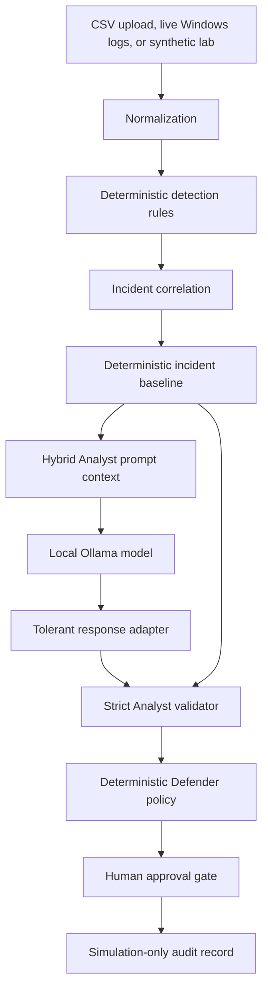

# RAVEN-SOC Architecture

## Security Contracts

The Analyst boundary accepts flexible local model text only before normalization. The internal Analyst object remains strict and is still checked by the existing validator.

Model-owned fields:

- `Status`
- `ThreatType`
- `Severity`
- `Confidence`
- `Summary`
- `SuspicionReason`
- `Inferences`
- `RecommendedActionID`

Baseline-owned fields:

- `ObservedEvidence`
- `MITRETechniques`
- `EvidenceIDs`
- `Target`

Safety-merged field:

- `RequiresApproval`

The model may increase approval requirements, but it may not remove an approval requirement established by the deterministic baseline.

## Detection and Correlation

Detection rules operate on normalized event fields and emit structured alerts with severity, confidence, MITRE mapping, evidence, and recommended action metadata. Correlation patterns merge related alerts into incidents while preserving the deterministic evidence identifiers and target selected by the pipeline.

Implemented correlation patterns include multi-stage intrusion, password spray, malware download and execution, and command-and-control beaconing.

## Fallback Behavior

Hybrid Analyst mode fails closed. If Ollama is unavailable, the model returns malformed output, a field cannot be normalized, or the strict validator rejects the result, RAVEN-SOC uses the deterministic baseline and records fallback metadata for diagnostics.

## State and Storage

The Streamlit dashboard stores interaction state in `st.session_state`. Live ingestion uses checkpoints so monitoring can resume from the intended Windows Event Log position. The local SQLite database stores ingested events for dashboard exploration.

## Defender Boundary

Defender recommendations are policy decisions, not real actions. Approval and rejection produce simulation-only audit records. The application never executes model output and never modifies endpoints, accounts, firewall rules, or processes.
